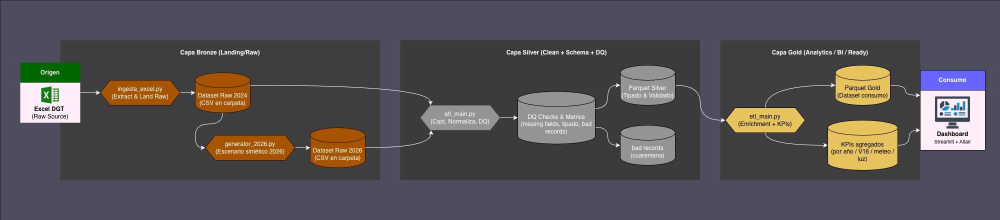
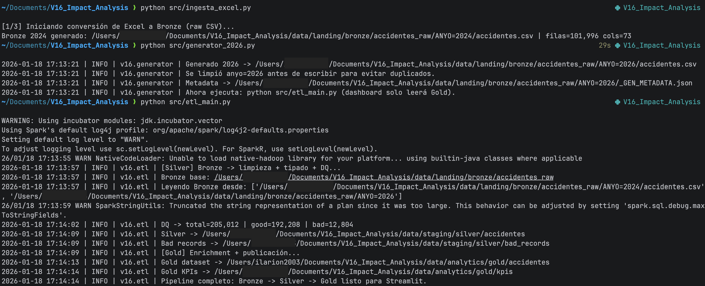
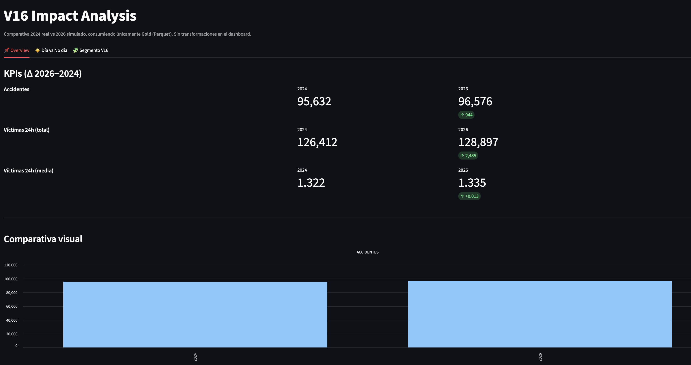
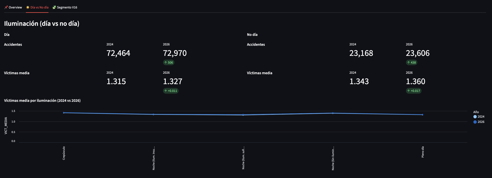

# V16 Emergency Beacon Impact Analysis — Data Engineering Pipeline (Bronze → Silver → Gold)

End-to-end Data Engineering project that builds a complete pipeline to analyze the potential impact of the V16 beacon rollout. It compares:

- 2024 (real accident data)
- 2026 (reproducible synthetic scenario)

The goal is to evaluate, with traceable and production-like data architecture, whether the measure reduces accidents and victims overall, and whether its effectiveness may vary under specific conditions (day vs non-day, visibility, weather, etc.).

This project is intentionally focused on Data Engineering (data ingestion, transformation, quality, and publishing), not on predictive modeling.

---

## Project highlights

- Medallion architecture: Bronze (raw) → Silver (clean + validated) → Gold (business-ready + KPIs)
- Scalable ETL with PySpark
- Parquet outputs with partitioning by year (`ANYO`)
- Data Quality checks with separation of invalid records (bad records)
- Streamlit dashboard that consumes only Gold (no reads from Bronze/Silver/Excel)

---

## Architecture

---

## Repository structure

```bash
V16_Impact_Analysis/
├── app/
│   └── dashboard.py
├── src/
│   ├── ingesta_excel.py
│   ├── generator_2026.py
│   ├── etl_main.py
│   ├── settings.py
│   └── utils.py
├── requirements.txt
└── README.md
```

---
## Tech stack

- Python
- PySpark (ETL)
- Parquet (analytical storage format)
- Pandas / PyArrow (fast analytical reads)
- Streamlit + Altair (interactive dashboard)

---

## Data notes

Source: 2024 accident data published by DGT (Excel).

Important: 2026 is not real data. It is a reproducible synthetic scenario generated under controlled assumptions to validate the pipeline end-to-end until real 2026 data becomes available.

---

## Requirements

- Python 3.10+
- Java 11 or Java 17 (required by PySpark)

Install dependencies:

```bash
pip install -r requirements.txt
```
---
## How to run (end-to-end)

### 1) Ingest Excel into Bronze (raw CSV)
```bash
python src/ingesta_excel.py
```
Expected output:
```bash
data/landing/bronze/accidentes_raw/.../accidentes.csv
```

### 2) Generate the 2026 synthetic scenario
```bash
python src/generator_2026.py
```
Expected output:
```bash
data/landing/bronze/accidentes_raw/.../ANYO=2026/accidentes.csv
data/landing/bronze/accidentes_raw/.../ANYO=2026/_GEN_METADATA.json
```

### 3) Run the full ETL (Bronze → Silver → Gold)
```
python src/etl_main.py
```
Expected output:
```
Silver dataset (clean + validated):
data/staging/silver/accidentes/ANYO=.../*.parquet

Silver bad records (invalid rows):
data/staging/silver/bad_records/ANYO=.../*.parquet

Gold dataset and KPIs (consumption-ready):
data/analytics/gold/...
```



### 4) Launch the dashboard (Gold-only)

```
streamlit run app/dashboard.py
```
## Dashboard metrics

### Overview (2024 vs 2026)



- Accident count
- Total victims within 24h
- Average victims per accident (24h)

### Day vs non-day segmentation



- Comparative metrics by lighting conditions
- Signals on scenarios where V16 may be more/less relevant

### V16 strategic segment


- Segmentation by `V16_ESTRATEGICA` (business rule computed in Gold)
- Comparative average impact by segment


## Data Quality (Silver)

Data Quality checks are executed in the Silver layer to improve reliability and traceability before publishing Gold datasets. Records that do not pass validation rules are not silently discarded. Instead, they are written to `bad_records/` to enable auditing, debugging, and future rule refinement.

Implemented checks:

- Missing required fields (null validation for critical columns)
- Range constraints (basic min/max validations for numeric fields)
- Corrupt record handling using Spark permissive mode (`_corrupt_record`)
- Domain validations captured as DQ flags (allowed-value checks for selected categorical fields)

Example: Silver validation + bad records separation (PySpark)

```python
df = _dq(_apply_casts(_read_bronze(spark)))

metrics = (
    df.agg(
        F.count(F.lit(1)).alias("total"),
        F.sum(F.when(F.col("DQ_IS_VALID"), 1).otherwise(0)).alias("good"),
    )
    .collect()[0]
)

good_df = df.filter(F.col("DQ_IS_VALID")).drop("DQ_IS_VALID")
bad_df = df.filter(~F.col("DQ_IS_VALID")).drop("DQ_IS_VALID")

_write_parquet(good_df, settings.SILVER_ACCIDENTES_DIR, partition_col="ANYO")
_write_parquet(bad_df, settings.SILVER_BAD_RECORDS_DIR, partition_col="ANYO")
```

## Key engineering decisions

- Parquet + year partitioning (ANYO) to optimize analytical reads
- Medallion layering for traceability and maintainability
- Dashboard reads only Gold to keep business logic in the ETL layer
- Synthetic 2026 dataset to validate the complete pipeline before real 2026 ingestion is possible


## Roadmap

- Add an explicit scenario marker column (e.g., IS_SYNTHETIC / SCENARIO) to strengthen lineage
- Extend KPIs (median, distributions, percentiles, ratio of accidents with zero victims, etc.)
- Add automated tests for Data Quality rules
- Optional: containerization (Docker) and cloud deployment (AWS)
